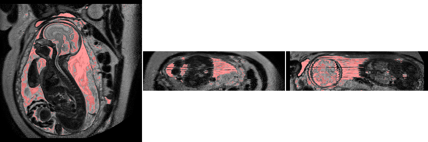
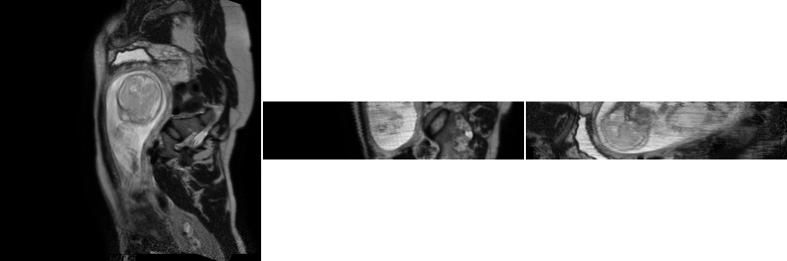

.. irtk documentation master file, created by
   sphinx-quickstart on Tue Aug 13 15:16:00 2013.
   You can adapt this file completely to your liking, but it should at least
   contain the root `toctree` directive.

irtk Python documentation
=========================

The aim of this module is to provide a simple and pythonic interface to IRTK
(http://www.doc.ic.ac.uk/~dr/software/) by considering a medical image as a
subclass of a numpy.ndarray containing information headers (dimension,
orientation, origin and pixel size). By overloading ``__getitem__``, slicing the
array automatically updates the dimension and origin information. Images are
manipulated in C++ as 4D images (IRTK behaviour), but flat dimensions are
removed from Python thanks to an automated call to ``numpy.squeeze``.

Indices are ordered TZYX, eg ``img[t,z,y,x]``, which corresponds to the raw
pixel array of IRTK but differs from the ``img(x,y,z,t)`` C++
interface. Nonetheless, the order in the information header still correspond to
the C++ order, that is to say ``img.header['dim'][0]`` corresponds to
``img.GetX()`` and is equal to ``img.shape[-1]``,  ``img.header['pixelSize'][0]`` corresponds to
``img.GetXSize()``, ``img.header['orientation'][0]`` corresponds to ``xaxis``,
and finally ``img.header['origin'][0]`` correspond to the X origin.

Below is a basic example:

.. code-block:: python

    # load the module
    import irtk
    
    # read an image
    img = irtk.imread("5066_4.nii", dtype="float32")
    print img.min(), img.max(), img.std() # methods inherited from numpy.ndarray

    # write a PNG thumbnail after saturation, displaying a segmentation by thresholding
    irtk.imshow(img.saturate(0.01,0.99), img > 2000, opacity=0.4, filename="thumbnail.png")

Below is a more complex example where we read several scans, register them all
to the first one and compute an average volume:              
               
.. code-block:: python

    import sys
    import irtk

    filenames = sys.argv[1:]

    img1 = irtk.imread(filenames[0], dtype='float32')
    img1 = img1.rescale()
    weights = (img1 > 0).astype('int')

    for f in filenames[1:]:
        img2 = irtk.imread( f, dtype='float32').rescale()
        t = img2.register(img1) # rigid registration
        img2 = img2.transform(t,target=img1) # linear interpolation by default
        img1 += img2
        weights += img2 > 0

    img1 /= weights.astype('float32') + 0.000001 # avoid division by zero

    # write image to disk
    irtk.imwrite( "average.nii", img1)

    # save thumbnail
    irtk.imshow( img1, filename="average.png" )
    

.. toctree::
      :maxdepth: 2

      why.rst              
               
Module reference
================

.. toctree::
   :maxdepth: 2

.. automodule:: irtk               
    :special-members: __new__
    :members:
       
Indices and tables
==================

* :ref:`genindex`
* :ref:`modindex`
* :ref:`search`

